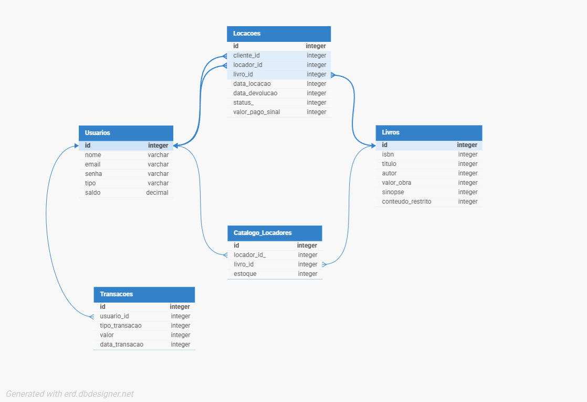

# Sistema de Gerenciamento de Aluguel de Livros

**Status do Projeto:** Finalizado

## 1. Visão Geral
Este projeto é um sistema web para gerenciamento de aluguel de livros, suportando perfis de Cliente e Locador. Ele implementa o fluxo completo de negócio, desde a gestão de catálogos e estoques até os processos de aluguel e devolução, com uma arquitetura que valoriza a lógica de negócio na base de dados.

---

## 2. Processo de Desenvolvimento

O desenvolvimento do projeto seguiu uma abordagem iterativa, focada em construir e validar as funcionalidades principais de negócio antes de refinar a interface do utilizador. As principais decisões de arquitetura foram tomadas para cumprir os requisitos específicos do desafio.

O fluxo de trabalho para a implementação de cada funcionalidade seguiu os seguintes passos:
1.  **Modelagem da Base de Dados:** Definição da lógica e da estrutura de dados diretamente no PostgreSQL, incluindo a criação de tabelas e funções.
2.  **Versionamento de Base de Dados:** Todas as alterações na base de dados foram versionadas com o Flyway, garantindo um setup reprodutível.
3.  **Desenvolvimento do Backend:** Criação das camadas de `Repository`, `Service` e `Controller` no Spring Boot para orquestrar a lógica de negócio e expor os endpoints.
4.  **Desenvolvimento do Frontend:** Construção das páginas `.jsp` para interação do utilizador, com um foco progressivo na melhoria da experiência e do design.
5.  **Testes e Validação:** Cada funcionalidade foi testada manualmente para garantir que o fluxo completo (frontend -> backend -> base de dados) funcionava como esperado.

---

## 3. Funcionalidades
- Cadastro e Login de Utilizadores (Clientes/Locadores)
- Gestão de Catálogo e Estoque para Locadores
- Fluxo Completo de Aluguel e Devolução de Livros
- Acesso a Conteúdo Restrito após Aluguel
- Carteira Virtual com Adição de Saldo
- Histórico de Transações Financeiras

## 4. Tecnologias
* **Backend:** Java, Spring Boot, Spring Data JPA
* **Frontend:** Java Server Pages (JSP), JSTL
* **Base de Dados:** PostgreSQL
* **Versionamento de Base de Dados:** Flyway

## 5. Arquitetura: Lógica na Base de Dados
Seguindo um requisito chave do desafio, as operações transacionais críticas (alugar, devolver, adicionar saldo, gerir estoque) foram implementadas como Funções no PostgreSQL. Esta abordagem garante a atomicidade e a integridade dos dados, sendo a aplicação Spring Boot responsável pela orquestração das regras de negócio, gestão da sessão e renderização da interface.

O sistema de autenticação foi implementado utilizando HttpSession para garantir uma entrega funcional e estável. Embora a abordagem ideal para um ambiente de produção seja o uso do Spring Security, foram encontrados problemas de configuração de última hora que impediram a sua utilização completa dentro do prazo. 

## 6. Diagrama da Base de Dados


## 7. Como Executar o Projeto

### Pré-requisitos
- JDK 17+
- Maven 3.8+
- PostgreSQL 14+

### Setup
1.  **Clone o Repositório:**
    ```bash
    git clone [https://github.com/DanielCabral/dunnas-desafio-aluguel-livros.git](https://github.com/DanielCabral/dunnas-desafio-aluguel-livros.git)
    cd dunnas-desafio-aluguel-livros
    ```

2.  **Crie a Base de Dados:**
    ```sql
    CREATE DATABASE aluguel_livros;
    ```

3.  **Configure a Conexão:**
    * Abra o ficheiro `src/main/resources/application.properties`.
    * Altere `spring.datasource.username` e `spring.datasource.password` com as suas credenciais do PostgreSQL.

4.  **Execute a Aplicação:**
    ```bash
    mvn spring-boot:run
    ```
    * A aplicação estará disponível em `http://localhost:8080`. O Flyway criará a estrutura da base de dados automaticamente.